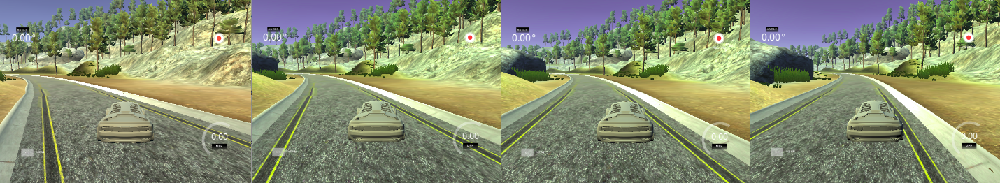

# Deep Learning Project 3: Behavioral Cloning Report 


The goals / steps of this project are the following:
* Use the simulator to collect data of good driving behavior
* Build, a convolution neural network in Keras that predicts steering angles from images
* Train and validate the model with a training and validation set
* Test that the model successfully drives around track one without leaving the road
* Summarize the results with a written report

Rubric points this report covers: 
https://review.udacity.com/#!/rubrics/432/view

I found this Q&A session (collection) with David Silver very useful to get started with this project. 
https://www.youtube.com/watch?v=rpxZ87YFg0M&t=504s&index=3&list=PLAwxTw4SYaPkz3HerxrHlu1Seq8ZA7-5P


## Submitted files

This project submission includes following files: 
- <b>model_track1.h5</b> - My NVIDIA EndToEnd model trained on Track 1 achieving good results up to 30mph (please use this model for evaluation!)
- <b>model_track2.h5</b> - My NVIDIA EndToEnd model retrained to Track 2 achieving good results upt to 11mph 
- <b>drive.py</b> - No changes to original drive.py, max speed at 11mph 
- <b>cloninig.py</b> - Contains my script to create and train the model 
- <b>retrain.py</b> - Contains my script to load an already trained model and retrain it (whole model) on a new dataset. This code leverages parts of drive.py to load parameters from the command line 
- <b>Behavioral_Cloning_report.md</b> - This is the report to my work you are reading at the moment
- <b>video.mp4</b> - Video of the autonomous pass of track1 at 20mph for the archive as requested by udacity- all other videos are uploaded to youtube and linked in order to not use unneccessary space on githup 

Video of passing Track 1 in CCW direction at 20mph:
https://youtu.be/w2GZK_rQggA

Video of passing Track 1 in CW direction at 20mph: 
https://youtu.be/GQk5JTCidPE

Video of passing Track 1 in CCW direction at 30mph: 
https://youtu.be/yny59EfSpY8

Video of passing Track 2 in CCW direction at 11mph: 
https://youtu.be/QrJ0A7D2xpo

Video of passing Track 2 in CW direction at 11mph: 
https://youtu.be/GFA9rM-rOVs


## Model Architecture and Training Strategy 

In the following I am documenting how I tackled the problem of choosing and building an architecture and collecting the right data so that the resulting model is able to steer the car in the simulation around the track without getting stuck or crash into something. The structure of this report is kind of a logbook documenting each experiment I performed to improve the networks abilities by adapting the architecture or collecting specific data. 

## Model architecture 

As suggested I implemented the NVIDIA Dave-2 End-To-End model architecture used in the project DAVE-2. This project is very similar to our attempt to “learn” the car to drive safely on the middle of the road/lane by using three camera images and a steering angle, although the NVIDIA project is of course of a much larger scale and complexity in data. They claim that their architecture design is chosen empirically through a series of experiments with varying layer configurations and had the best success with this presented architecture, so I am going along with it because they had much more data, computational power and time to test many configurations than I have. 

I started out with the layer architecture according to the blog post by NVIDA (https://devblogs.nvidia.com/parallelforall/deep-learning-self-driving-cars/) consisting of:
- 5 Convolutional Layer
- 3 Fully Connected Layer
- RELU Activations
- MSE Loss Function and 
- AdamOptimizer (no manual learning rate set)

First without using any dropout layer or regularizations and then added drop out to the connected layers with 20% dropout chance. I divided my collected data set into 80% training data and 20% validation data.    


```python
	print("Using NvidiaEndToEnd")
	# Cropping cropping=((top,bottom),(left,right))
	model.add(Cropping2D(cropping=((70,25), (0,0)))) 
	# subsample == strides 
	model.add(Convolution2D(24, 5, 5, subsample=(2,2), activation = 'relu'))
	model.add(Convolution2D(36, 5, 5, subsample=(2,2), activation = 'relu'))
	model.add(Convolution2D(48, 5, 5, subsample=(2,2), activation = 'relu'))
	
	model.add(Convolution2D(64, 3, 3, activation = 'relu'))
	model.add(Convolution2D(64, 3, 3, activation = 'relu'))

	model.add(Flatten())
	model.add(Dense(100))
	model.add(Dropout(0.2))
	model.add(Dense(50))
	model.add(Dropout(0.2))
	model.add(Dense(10))
	model.add(Dropout(0.2))
	model.add(Dense(1))
```


## Data collection strategies 

I identified three different types of road on the track: 
- “Normal road” with yellow lane markings and a gutter like structural road limitation, dark pavement 
- Red/White road markings at curves, dark pavement 
- Bridge with a cobblestones like road surface and a wall as structural road limitation 
- Road parts without a boarder or markings, dark pavement 


The lightning conditions does not vary very much when the car is driving around the track. A very strong environment lightning is applied to the simulation because there are no drop shadows at all, which is an ideal scenario for applications using edge information. The only shadow I see, is when the car is turning into the direction of the light source the cars rear side is getting slightly darker. Therefore I think I do not have to take into account lightning very much.   

The car should learn to
- Drive in the middle of the road at all of these identified road types
- Learn to steer away from the road edge if it runs towards it (recovery data)

The network is going to form weights for two different tasks: Some kind of feature extractor for the road boundaries and a steering controller to keep the car in the human “comfort zone”. Because of that, on one hand each of these road segments have to be present in the data in a more or less balances relationship, on the other hand the car also has to learn different steering angles in different car poses to the road edge, which also has to be balanced. 

I think balancing of the dataset is a crucial part of this project. Steering angles have to be in balance for each road class and each road class has to be in balance to each other. The steering angles can easily be plotted for the whole dataset but it does not give any information if the steering angles are distributed well per road class. Additional labeling of the road type for each frame would make this possible and could be done by hand. :) But this is not an option. 

If the cars longitudinal axis has a very steep angle to the road edge, it should apply a large steering angle towards the middle of the road. If the car longitudinal axis has a flat angle to the road boundaries, it should keep the steering angle constant or small. 

I assume that the virtual cameras are pointing exactly into the direction of the cars longitudinal axis, so that the car is driving exactly into the direction of the cameras z-Axis when the steering angle is zero. Additionally I suppose the simulation takes care about the extrinsic calibration of the  camera to the car chassis (maybe it is done according to ISO 8855?).Otherwise we would have take account of the extrinsic calibration of the cameras to the car chassis too. 

I collected a small dataset of 
- driving at the track center
- driving through all narrow curves
- driving over the bridge and
- driving along parts without road markings or edge.

I figured out that I actually do not have to drive the car to collect data because the velocity/throttle is not used (or at least not required to use) in the training of the model because it is set anyway by the driver.py script. 

So to collect recovery data I placed the car in different angles to the road edge, set a driving angle towards the middle of the road and took very short catches of these static scenes. That way I generated recovery data on the “normal road” with yellow lane markings, in curves with red/white markings, at the road parts without any boundaries and on the bridge. (Unfortunately the steering angle was reset to 0° as I took the screenshots - imagine that the front wheels are pointing into the direction of the middle of the road)



Additionally I took slightly longer sequences driving along the middle of the road on “normal road” parts, on the bridge and recorded each of the narrow curves with red/white markings. 

### Data augmentation 

By applying horizontal flipping on center, left and right image I generate additional augmented data for my network. This should help to generalize and balance the data in respect to the steering angles. Otherwise because it is a circle track, steering angles would mainly point into one direction if I train the network only in clockwise or counter clockwise direction of the track. 

If this data augmentation is not sufficient to generate enough data, there are several way to produce more augmented data: 
- Adding a jitter to the images 
- Applying affine transformations to the images, like translating the images futher to the right or to the left --> Keep in mind that then a correction factor has to be applied to the steering angle too 
- Adding "shadows" to the images by altering the brightness of parts of the image 

The keras ImageDataGenerator could be used to apply these augmentations online and generate a randomly augmented batch for each epoch. That way each epoch a entirely new augmented dataset is generated never looking the same as the last one. This is kind of taking pictures out of a never depleating dataset of new images, which seems to be a powerful way to generalize a small dataset. 

https://keras.io/preprocessing/image/


## Experiments 

### Experiment 1 

For my first experiment I collected 5040 total of center, left and right camera. With my horizontal flip data augmentation I came on a total of 10080 samples to train my network. The training took about 220 seconds per epoch on my old i5 laptop and I ran seven epochs. The Steering angles are distributed around 0 as expected because of the horizontal flip and it looks almost like the beloved Gaussian Distribution. :) The two peaks at 0.24 and -0.24 are because thats the smallest angles I managed to set with mouse steering and the track does not contain a really straight part and lot of parts with small curvature where I had slightly to steer right or left. (I could have changed the bin size of the histogram to improve the visualization)


#### Track 1

As I started my simulation in autonomous mode, I was really surprised. The car managed to stay on the road and I had to stop the simulation because it just ran and ran and ran all around. The car even recovers to the middle of the road when I provoke drifting out to the side of the road manually. I am very impressed that this works so good, the driving is a little bit shaky but keeps the car very stable at the middle of the road. 

I found out that I can set the speed in the driver.py file. As I go up with the speed the controlling of the car gets shakier and at speed over 22 mph the controller is starting to overshoot. So I thought I want to be faster and try do a better collection of data from scratch based on my theories. 

#### Track 2

The model does not generalize well and fails on track 2 miserably maybe because of the different road appearance (and maybe the hills and valleys which lead to alterations of the lane vanishing points, I think). It drives right into the side of the road after the start.


### Experiment 2

Again I collected according to my assumptions of what has to be in the training set. I collected slightly about 3645 frames of center, left and right camera boosted to 11208 frames by augmentation. I specifically laid an emphasis on recovery data this time. The distribution of the steering angles looked okay: 


But this time I apparently collected to much data at the side of the road because my model pretty much likes the left road edge and does not manage to get to the middle of the road at some point it then crashes. So I can see, that the distribution of the steering angles for the whole dataset may not be the best way to determine the quality of the dataset. Because the model performed that bad, I decided to discard this dataset and start a next try.


### Experiment 3

In my third experiment I collected more data driving at the middle of the road and kept attention to not collect to much recovery data on the road sides in contrast to the data collected at the middle of the road. 

This time I collected 5691 frames which are boosted to 11382 frames by augmentation, so slightly more data than in my first experiment. I additionally added dropout layers with 20% drop probability to the three connected hidden layers at the end of the network to improve generalization. Again the steering angle distribution looked okay: 


#### Track 1

I was happy to see, that this model also performs very well on the course at a speed of 11 mps. That means that my first experiment wasn’t just a random hit. :) At higher speeds it gets a little bit shaky at some road parts but up to a speed of 23 mph it shows quite good performance. So I managed to improve the network performance. 

#### Track 2

Also it did not crash right at the beginning of track 2 and made it surprisingly far on the track without any additional data from track 2. 

### Experiment 4

In my fourth experiment I wanted to load my model weights of the first experiment and further train the model with my dataset of experiment 3 to check if the performance of the model could be improved by using my dataset of Experiment 3 ontop of the resulted weights of experiment 1. Luckily this is also very simple in Keras and the saved .h5 file contains everything I need: network architecture and weights. I loaded the network weights using load_model of the Keras library. 

#### Track 1

With this additional training I managed to run around the track at the full speed of 30 mph without crashing. It gets shaky at some parts but never looses control of the car. At the speed of 11 mph it performs very well to keep the center of thre road at all parts of the course. 

#### Track 2

Sadly at track 2 it does bang the car into the very same palm like my model of experiment 3. Because I was pretty satisfied with the performance of the model on track 1 I decided to collect some data at track 2 to improve the performance of the model on track 2. 

### Experiment 5

So I collected additional 3606 frames (middle, right, left) on the track on parts that I identified to be difficult: 
- Hill climbs and drops → The camera sees distorted lane markings
- Hill tops → Cameras are pointing to the sky and do not see the road at all
- Sharp curves → With vertical structural limitation

The performance impressively improved by this small set of images but my car get stuck on one of the steep climbs of the track. To see where it also fails I helped it manually to get free. After this steep climb it got really far past the bridge and the parallel road to the starting point. Right behind this point there are two very narrow curves with this vertical structural road limitation where it did not manage to get the curve.   

This is the first point on track 2 where my car is coming too far to the left and get stuck on the side of the road. Because of the steep and curved climb the road is distorted massively in the camera view. I think the car tries to keep the center line of the distorted road edges which leads it far to the left. 


This is the second point on track 2 where my car gets stuck in the very narrow curve at about three third of the track. It is right behind a steep climb where the car cant see the oncoming curve and it is reacting to slow to be able to take it. 


I decided to give it another experiment and to collect data on these two passages to do a fine tuning. Maybe I manage that I pass the second track 2 without to get stuck.  

### Experiment 6

I collected additional 4185 frames at the two passages where my car gets stuck which gives me another 8370 frames with augmented images. This dataset is bigger than the first one I took on track 2 for tuning my model weights I hope it does not affect the overall good performance I achieved till now. 

And YEAH! It passed the second track without getting stuck or fall of a cliff. Additionally it has a very stable and nice driving style. I managed to collect the right data to further improve the network performance. I am getting a grip of it I think.


### Experiment 7

I was curious if the model now performs better on track 1. Surprisingly the new data did not improve the performance on track 1 at all, in contrary the driving stability at higher speeds decreased drastically. Also at lower speeds the driving got more shaky and uncertain. So the model became very track specific after training with the additional data of track 2. 

### Experiment 8 

Now I wanted to know if the trained models are also able to drive the track in the other direction, so I started the simulation and drive.py and turned the car around manually at the starting point. Fortunately booth models perform as well in the clockwise direction as they do in the counterclockwise direction. 

## Conclusion

I am still impressed by the performance of the network to control the car, although it is surely much more work to get a network to run that well on “real life” data like NVIDIA did in their project DAVE-2. Also it seems to be very hard to get a generalized network. I managed to retrain an already well fitted network on track 1 to steer the car very stable through the much more complex track 2. But then the resulting network performed worse when applied to track 1 again. 

I started out with a relatively small dataset and added bit by bit more data and fine tuned the network till it performed the way I wanted. 

First experiment 5040 

Second experiment dumped 

Third experiment 5691

Total experiment 10731 


Fifth experiment 3606

Sixth experiment 4185

Total Track 2  7791 


Total frames used track 1 and track 2 combined with augmentation 37044 


What I have learned in this lesson is that I have to think about my data. It is important to capture a lot of data but it has to be balanced between identified classes and problems.  

I am surely going to take my experiments further and try to take throttle and speed into account so that the network also has to learn a speed controller but now I have to proceed with the next project. 


```python

```
